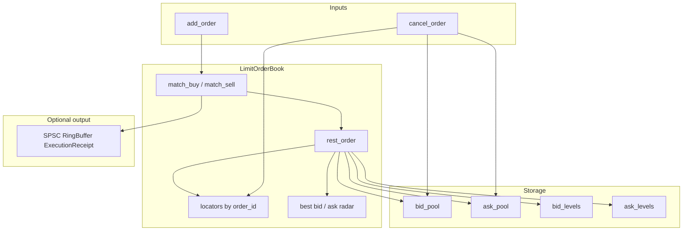

# Architecture

Single-instrument limit order book. Hot paths exclude logging, I/O, strings, hash maps, linked lists, and per-order heap allocation.

## Control flow



## Design constraints

| Constraint | Implementation |
| --- | --- |
| Dimensions | `BookConfig` at construction; no hardcoded pool or level sizes |
| Side | Implied by `bid_pool_` or `ask_pool_`; `Order` has no side field |
| Order lookup | Flat `locators_[order_id]`; O(1) cancel and duplicate-ID check |
| Queue identity | `OrderRef { index, generation }` per FIFO entry |
| Cancellation | Lazy: volume zeroed, slot deallocated, generation incremented; queue slot may remain |
| Best price | `bid_words_` / `ask_words_` bit radar; `__builtin_ctzll` / `__builtin_clzll` |
| Fills | Optional `RingBuffer<ExecutionReceipt>*`; one push per fill when attached |

## Memory layout

For `price_level_count = N`, `level_queue_capacity = Q` (power of two):

| Structure | Shape |
| --- | --- |
| `bid_pool_`, `ask_pool_` | `order_pool_capacity` × `Order` each |
| `bid_levels_`, `ask_levels_` | `N` × `PriceLevel` |
| `bid_orders_`, `ask_orders_` | `N × Q` × `OrderRef` |
| `bid_words_`, `ask_words_` | `⌈N / 64⌉` × `uint64_t` |
| `locators_` | `max_order_id + 1` × `Locator` |

Each `PriceLevel` binds to `orders_ + tick × Q` at construction. Ring indices use `mask = Q - 1`.

## `add_order` pipeline

```text
validate (volume, tick, order_id, duplicate active id)
if Limit+GTC: inline fast path in header
else: forward to add_order_slow (Market / IOC / FOK)
match_buy | match_sell
  clean_front (skip invalid head; compact after 8 consecutive stale pops)
  fill FIFO head at best opposite price
  push ExecutionReceipt if ring attached
  erase best price when level volume reaches zero
rest_order if incoming volume > 0
  allocate pool slot, push OrderRef, update locator, set radar bit and best price
return AddResult (matched/rested/dropped volumes)
```

## Invariants

| Invariant | Value |
| --- | --- |
| `sizeof(Order)` | 16 bytes, `alignof` 16, no pointers |
| Priority | Price, then FIFO within tick |
| Valid `order_id` | `0 .. max_order_id` |
| Valid `price_tick` | `0 .. price_level_count - 1` |
| `level_queue_capacity` | Power of two |
| Empty bid side | `best_bid_tick() == UINT32_MAX` |
| Empty ask side | `best_ask_tick() == UINT32_MAX` |

## Complexity

| Operation | Typical | Notes |
| --- | --- | --- |
| `add_order` (rest) | O(1) | Pool allocate, level push |
| `add_order` (match) | O(levels crossed + tombstones at touch) | `clean_front` compacts after 8 stale pops |
| `cancel_order` | O(1) | Locator, pool deallocate; optional level clear |
| Best-price update (new level) | O(1) | Compare against cached best |
| Best-price refresh (level empty) | O(ticks / 64) | Bit scan via `next_ask` / `next_bid` |
